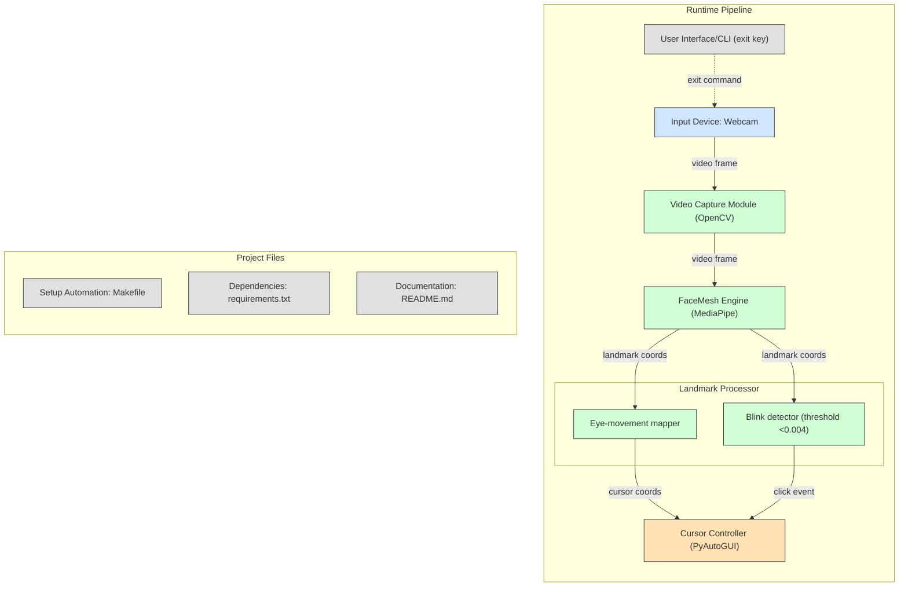

# 👁️🖱️ Eye Controlled Mouse

A Python-based computer vision project that lets you control your mouse **using your eyes**!  
Built using `MediaPipe`, `OpenCV`, and `PyAutoGUI`, this program tracks your eye movements and blinks to move the cursor and perform clicks, offering a futuristic hands-free experience.

---

## 📦 Features

- ✅ Real-time face and eye landmark tracking with MediaPipe
- 🧠 Cursor control using eye movement
- 👁️ Blink-based click detection
- 🔁 Smooth and responsive performance
- 🖥️ Simple setup with `Makefile`

---

## 📸 Demo

>   
> *Demo of eye tracking and click gesture*

---

## 🧰 Requirements

Install these using the `Makefile` or manually via `pip`:

```
mediapipe
opencv-python
pyautogui
```

---

## 🧪 Setup Instructions

### 🔧 1. Clone the Repository

```bash
git clone https://github.com/yourusername/eye-controlled-mouse.git
cd eye-controlled-mouse
```

### ⚙️ 2. Run with Makefile (Recommended for Windows)

```bash
make all
```

Or manually:

```bash
python -m venv venv
venv\Scripts\activate
pip install -r requirements.txt
python main.py
```

---

## 🧠 System Architecture

The following diagram describes the flow of data and modules involved in this project:



> ☝️ You can view this Mermaid diagram properly on platforms like GitHub (with Mermaid enabled), Obsidian, or VS Code (with Mermaid plugin).

---

## 🎮 Controls

| Action            | Trigger                            |
|------------------|------------------------------------|
| Move cursor       | Move your right eye                |
| Click             | Blink left eye (detects vertical distance) |
| Exit Program      | Press `Q` on your keyboard         |

---

## 📁 Project Structure

```
.
├── main.py             # Main application code
├── Makefile            # Automation for setup and run
├── requirements.txt    # Project dependencies
├── README.md           # Project documentation
```

---

## 🐞 Troubleshooting

- Make sure your webcam is functional.
- Run the script in good lighting for accurate detection.
- If `pyautogui` clicks too frequently, adjust the blink detection threshold (`<0.004`).

---

## 💡 Future Improvements

- Add support for both eyes or head movement
- Gesture-based scrolling
- Cross-platform support with Linux/MacOS setup

---

## 🧑‍💻 Author

**Sarthak Dongare**  
📧 Mail : [Mail](sarthakdongare8@gmail.com)  
🌐 Portfolio: [Portfolio](https://my-new-prof.vercel.app/)  
🐙 GitHub: [@Frosty-8](https://github.com/Frosty-8)

---

## 📜 License

This project is licensed under the MIT License - see the [LICENSE](LICENSE) file for details.

---

> ✨ *Built with Python, passion, and a blink of an eye!*


